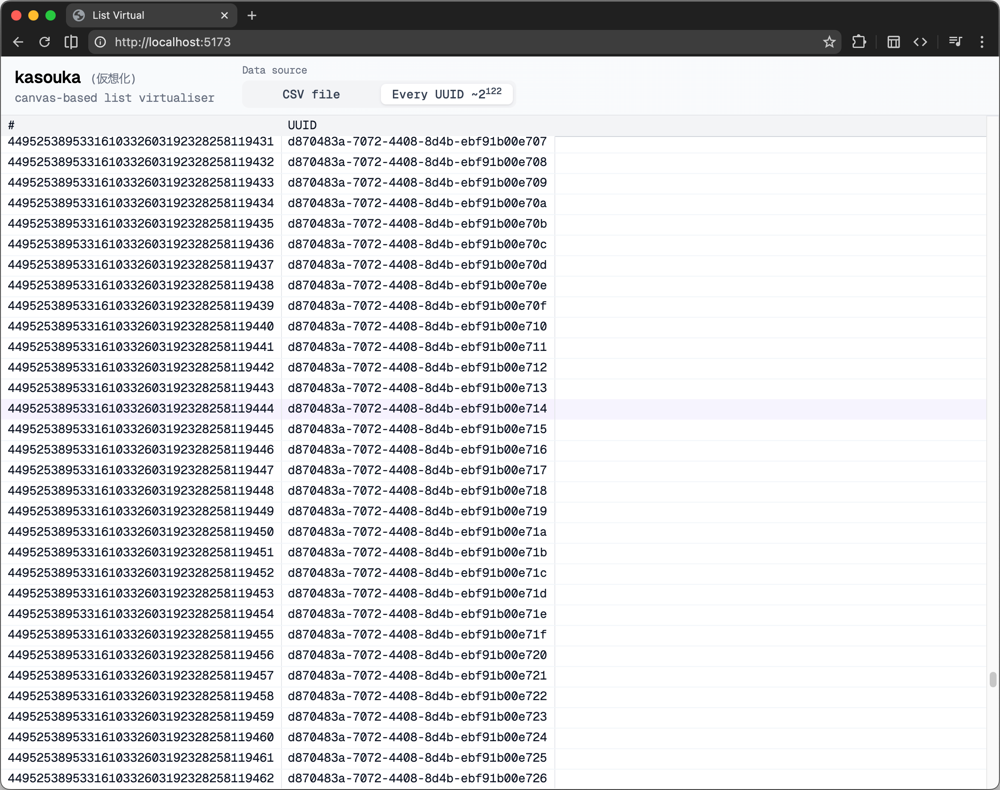

# kasouka

virtual canvas table for large datasets

## features

- silky-smooth canvas-based rendering
- millions of millions of rows smooth scrolling
- datasource abstraction
  - `/virtual` - virtual data example, derived from row index
  - `/every-uuid` - another virtual data example - all 2^122 uuids
  - `/csv` - for small scale csv data. (web-workers/larger csvs coming soon)

## demo
check out [`demos/vanilla`](https://kasouka.vercel.app) for a working example